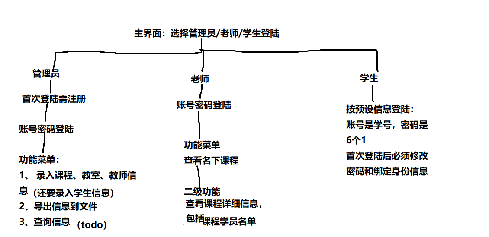
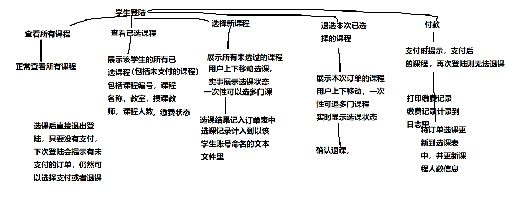

# 培训中心管理系统

## Quick Start

双击exe文件启动

1. 先注册管理员账号, 进入教室管理，新增几个教室；进入教师管理，新增几个教师；再进入课程管理，新增几个课程。

2. 再退出到首页，注册学生账号，选择几门课程
3. 再退出到首页，选择老师登陆，查看其名下的课程及学生名单

## 架构解释

系统有3类用户：管理员/老师/学生

管理员：可以对 教室/教师/课程 资源进行增删改查

老师：可以查看个人名下的课程, 及课程对应学生名单

学生： 可以选课/退课/付款 等

学生操作流程

